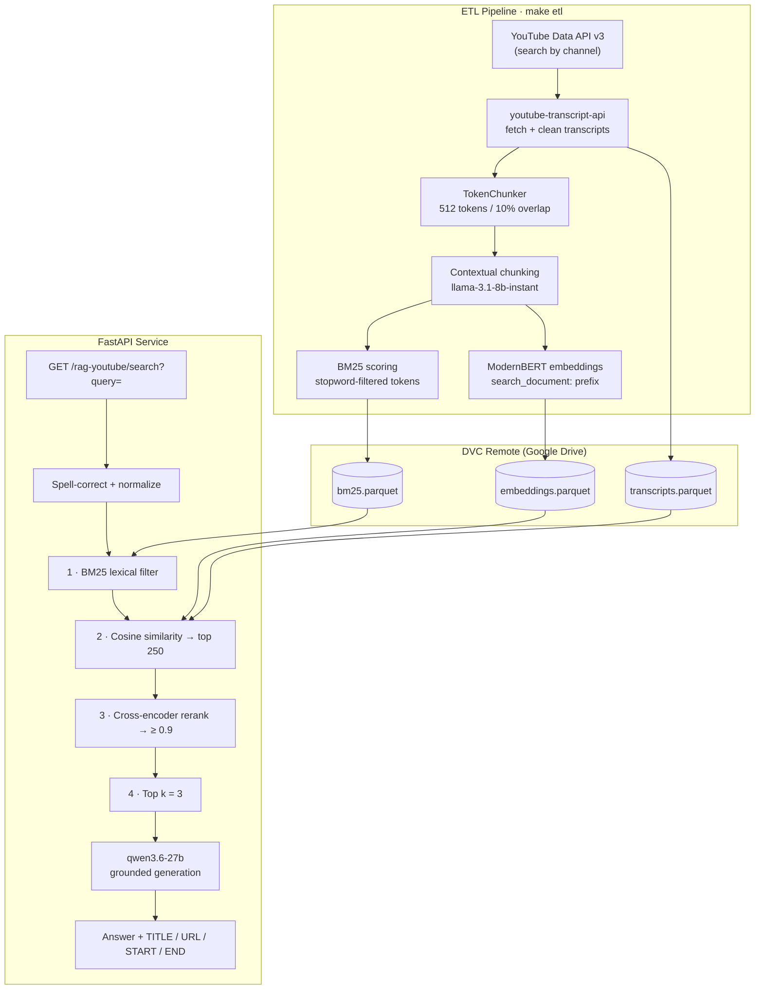

# RAG over YouTube Transcripts

A production-shaped Retrieval Augmented Generation service that answers natural-language questions using the spoken content of YouTube videos — and points you to the exact stretch of video where the answer lives.

Ask *"how does contrastive learning actually work?"* and you get a grounded answer plus a ranked set of video titles, URLs, and start/end marks telling you where to watch.

The system combines **contextual chunking**, a **precomputed BM25 index**, **dense bi-encoder retrieval**, and **cross-encoder reranking** into a single cascading funnel, served behind a FastAPI application and packaged with Docker.


---

## Table of Contents

- [Overview](#overview)
- [Architecture](#architecture)
- [The Retrieval Funnel](#the-retrieval-funnel)
- [Ingestion: The ETL Pipeline](#ingestion-the-etl-pipeline)
  - [Contextual Chunking](#contextual-chunking)
  - [Embedding Generation](#embedding-generation)
  - [BM25 Index Construction](#bm25-index-construction)
- [Generation](#generation)
- [API Reference](#api-reference)
- [Project Structure](#project-structure)
- [Getting Started](#getting-started)
- [Usage](#usage)
- [Configuration Reference](#configuration-reference)
- [Artifacts](#artifacts)
- [License](#license)

---

## Overview

Video is a terrible medium for retrieval. The knowledge is there, but it's locked inside an hour of speech with no index. This project turns a curated set of YouTube channels into a searchable, citable knowledge base.

| | |
|---|---|
| **Corpus** | Transcripts from 16 configurable YouTube channel IDs |
| **Chunking** | 512 tokens, 10% overlap, **LLM-generated context prefix per chunk** |
| **Lexical retrieval** | BM25 (k₁ = 1.5, b = 0.75), scores precomputed offline |
| **Dense retrieval** | `nomic-ai/modernbert-embed-base`, normalized, cosine via dot product |
| **Reranking** | `cross-encoder/ms-marco-MiniLM-L-12-v2` with sigmoid activation |
| **Generation** | `qwen/qwen3.6-27b` via Groq |
| **Serving** | FastAPI + Uvicorn, containerized |
| **Storage** | Parquet artifacts, DVC-versioned on Google Drive |
| **Citations** | Video title, URL, and fractional start/end marks in every grounded answer |

**Stack:** Python 3.11 · Polars · Chonkie · sentence-transformers · PyTorch · Groq · FastAPI · NLTK · DVC · uv · Docker

---

## Architecture



---

## The Retrieval Funnel

Retrieval is a four-stage cascade, deliberately ordered cheapest-to-most-expensive. Each stage narrows the candidate set so the next stage only pays for what survived.

**Stage 0 — Query preprocessing.** Punctuation is stripped, whitespace collapsed, and each token spell-corrected with `pyspellchecker` (edit distance 1). This protects the lexical stage from typos, which BM25 has no tolerance for.

**Stage 1 — BM25 lexical filter.** `bm25.parquet` holds a precomputed score for every `(video_id, chunk_index, token)` triple. Query tokens are matched against it, per-chunk scores are summed, and the result is sorted descending. Because scoring happened offline, this is a scan-and-aggregate — no term statistics computed at request time. If nothing matches, an empty frame is returned and the LLM falls back gracefully (see [Generation](#generation)).

**Stage 2 — Dense similarity.** Surviving chunks are joined to the embeddings knowledge base. The query is encoded with the `search_query: ` prefix and L2-normalized, so cosine similarity reduces to a dot product. Chunks with positive similarity are sorted and truncated to the **top 250**.

**Stage 3 — Cross-encoder reranking.** The 250 survivors are scored by a cross-encoder that reads the query and the chunk *jointly* — far more accurate than comparing independently-computed vectors, and far too slow to run on the full corpus. Sigmoid activation makes the output a calibrated 0–1 relevance probability, which is what makes the `threshold: 0.9` cutoff meaningful rather than arbitrary. Anything below the bar is dropped entirely.

**Stage 4 — Top-k.** The `k` highest-scoring chunks (default 3) become the context.

Each surviving chunk carries `start` and `end` — the chunk's position expressed as a fraction of the video, derived from `chunk_index / chunk_count`. These become the "watch from here" marks in the final answer.

---

## Ingestion: The ETL Pipeline

`src/rag_youtube_transcripts/pipelines/etl.py` — run with `make etl`.

Channel IDs are processed **in parallel** via `joblib` (`n_jobs=-1`). For each channel, the YouTube Data API's `search` endpoint returns up to `max_results` videos ordered by publish date. Videos already present in `transcripts.parquet` are skipped, as are videos with no available transcript — so repeat runs are incremental and the corpus grows over time rather than being rebuilt.

Fetched transcripts are lowercased, whitespace-normalized, and HTML entities (`&#39;`, `&quot;`, `&amp;`) are decoded. If no new videos are found, the entire embedding stage is skipped.

### Contextual Chunking

This is the most interesting part of the ingestion pipeline.

Standard chunking destroys context. A chunk that says *"this makes it much faster than the previous approach"* is nearly useless for retrieval — the embedding has no idea what "this" or "the previous approach" refer to.

The fix, following Anthropic's contextual retrieval work: before embedding, ask an LLM to write a 2–4 sentence situating description of each chunk **given the full transcript**, then prepend it. The same chunk becomes *"This section discusses FlashAttention's memory-efficient tiling... this makes it much faster than the previous approach."* — now independently meaningful and independently retrievable.

Implementation details:

- `chonkie`'s `TokenChunker` splits on the embedding model's own tokenizer, so chunk boundaries respect the model's actual token budget rather than an approximation.
- Chunk size 512 with 10% overlap (51 tokens), so information straddling a boundary appears in both chunks.
- Transcripts longer than `max_input_tokens` (102,400) are truncated before contextualization to stay inside the context window.
- Context generation runs at `temperature: 0.0` for determinism.

### Embedding Generation

Chunks are embedded with `nomic-ai/modernbert-embed-base` and L2-normalized. Nomic's models are **asymmetric** — they require task prefixes, and getting this wrong silently degrades retrieval quality:

- Documents are embedded as `search_document: {chunk}`
- Queries are embedded as `search_query: {query}`

Vectors are JSON-serialized into a string column and appended to `embeddings.parquet`, keyed on `(video_id, chunk_index)`.

### BM25 Index Construction

`create_bm25_dataset` rebuilds the full lexical index with Polars' lazy engine, streaming the result straight to disk via `sink_parquet`.

1. Chunks are lowercased, stripped to `[a-z0-9\s]`, split on whitespace, and filtered against NLTK's English stopword list (punctuation removed from the stopwords themselves so they match the cleaned tokens).
2. Global statistics — mean tokens per chunk and total chunk count — are collected in a single pass.
3. Term frequency is aggregated per `(video_id, chunk_index, token)`.
4. Document frequency and IDF are computed per token with standard BM25 smoothing:

$$\text{IDF}(t) = \ln\left(\frac{N - n_t + 0.5}{n_t + 0.5} + 1\right)$$

5. The final score applies length normalization against the corpus average:

$$\text{score}(t, c) = \text{IDF}(t) \cdot \frac{f_{t,c} \cdot (k_1 + 1)}{f_{t,c} + k_1 \cdot \left(1 - b + b \cdot \frac{|c|}{\text{avgdl}}\right)}$$

The whole table is rebuilt on every run rather than updated incrementally — correct, since IDF is a global quantity that shifts whenever the corpus grows.

---

## Generation

The final answer is produced by `qwen/qwen3.6-27b` on Groq. The system prompt encodes three behaviors:

**Grounded mode.** When retrieval returns usable context, the model must cite the `TITLE`, `URL`, `START`, and `END` of every video it draws on. Citations are mandatory, not encouraged.

**Graceful degradation.** When context is empty, irrelevant, or insufficient, the model is instructed to answer from parametric knowledge *with sources*, explicitly told not to fabricate, and told to append a YouTube search URL for the original query. This matters more than it looks: an aggressive `threshold: 0.9` means empty retrieval is a normal outcome, not an error state, and the system stays useful instead of returning "I don't know."

**Readability.** Output is formatted for human consumption rather than dumped as raw context.

Multiple retrieved chunks are joined with a configurable delimiter so the model can tell sources apart.

---

## API Reference

Base path: `/rag-youtube`

### `GET /rag-youtube/healthz`

Liveness probe.

```json
{ "status": "ok" }
```

### `GET /rag-youtube/search`

| Parameter | Type | Description |
|---|---|---|
| `query` | `string` | Natural-language question |

```bash
curl -G http://localhost:8080/rag-youtube/search \
     --data-urlencode "query=how does contrastive learning work"
```

```json
{
  "response": "Contrastive learning trains a model to pull ...\n\nTITLE: ...\nURL: https://youtu.be/...\nSTART: 0.34\nEND: 0.41"
}
```

Interactive docs are served at `/docs` (`http://localhost:8080/docs` in Docker, `http://localhost:8000/docs` under `make api`).

---

## Project Structure

```
.
├── src/rag_youtube_transcripts/
│   ├── config.py              # Config.Paths + OmegaConf params loader
│   ├── logger.py              # Loguru: stderr INFO + rotating DEBUG file, 2-day retention
│   ├── rag.py                 # prompt assembly + Groq generation
│   ├── utils.py               # ingestion, embedding, BM25, retrieval
│   ├── app/
│   │   ├── main.py            # FastAPI app factory
│   │   ├── router.py          # /rag-youtube prefix
│   │   └── endpoint.py        # /healthz, /search
│   └── pipelines/
│       └── etl.py             # parallel fetch → chunk → embed → index
├── artifacts.dvc              # DVC pointer to artifacts/ (~405 MB, 3 files)
├── params.yaml                # channels, models, prompts, thresholds
├── Dockerfile                 # multi-stage uv build, inference-only
├── docker-compose.yaml        # backend service, 8080:8000
├── Makefile
└── pyproject.toml
```

Note the `.dockerignore`: it whitelists the package but **excludes `pipelines/`**, so the shipped image contains only what's needed to serve. `docker-compose` bind-mounts `artifacts/` and the NLTK data rather than baking 405 MB into the layer.

---

## Getting Started

### Prerequisites

- Python 3.11
- [uv](https://docs.astral.sh/uv/)
- Docker (optional, for containerized serving)
- A [Groq API key](https://console.groq.com/) and a [YouTube Data API v3 key](https://console.cloud.google.com/)
- Access to the DVC Google Drive remote (or your own)

### Installation

```bash
git clone https://github.com/ncheymbamalu/rag-youtube-transcripts.git
cd rag-youtube-transcripts

make install     # uv sync
make nltk        # download the NLTK stopword corpus into .venv/nltk_data
```

### Environment

Create a `.env` in the project root:

```dotenv
GROQ_API_KEY=gsk_...
YOUTUBE_DATA_API_KEY=AIza...
```

### Artifacts

```bash
dvc pull         # fetch transcripts.parquet, embeddings.parquet, bm25.parquet
```

To use your own remote, point `.dvc/config` at your Drive folder:

```bash
dvc remote modify myremote url gdrive://<YOUR_FOLDER_ID>
```

---

## Usage

### Run the API locally

```bash
make api         # uvicorn with --reload → http://localhost:8000/docs
```

### Run in Docker

```bash
make start_container   # docker compose up -d → http://localhost:8080/docs
make stop_container
```

### Refresh the corpus

```bash
make etl               # dvc pull → fetch → chunk → embed → index
make update_artifacts  # dvc add → git commit → dvc push → git push
```

### Development

```bash
make check       # ruff check src
make fix         # ruff check --fix src
make clean       # remove __pycache__, .ruff_cache, .pytest_cache
```

### Programmatic use

```python
from rag_youtube_transcripts.rag import generate_response
from rag_youtube_transcripts.utils import get_semantic_search_results, wrap_text

results = get_semantic_search_results("what is a mixture of experts")
print(results)

print(wrap_text(generate_response("what is a mixture of experts")))
```

---

## Configuration Reference

Everything lives in `params.yaml`.

### Corpus

| Key | Default | Description |
|---|---|---|
| `youtube_data_api` | Search endpoint URL | YouTube Data API v3 search |
| `youtube_channel_ids` | 16 IDs | Channels to ingest |
| `max_results` | `50` | Max videos per channel per run |

### Chunking & Embedding

| Key | Default | Description |
|---|---|---|
| `chunk_size` | `512` | Tokens per chunk (overlap is `chunk_size // 10`) |
| `max_input_tokens` | `102_400` | Transcript truncation limit for contextualization |
| `embedding_model` | `nomic-ai/modernbert-embed-base` | Bi-encoder |
| `reranker_model` | `cross-encoder/ms-marco-MiniLM-L-12-v2` | Cross-encoder |

### Models

| Key | Default | Description |
|---|---|---|
| `llm.contextual_chunking` | `llama-3.1-8b-instant` | Fast, cheap model for context generation |
| `llm.rag` | `qwen/qwen3.6-27b` | Answer generation |
| `temperature.contextual_chunking` | `0.0` | Deterministic context |
| `temperature.rag` | `1.0` | Answer sampling |
| `max_output_tokens.contextual_chunking` | `1024` | |
| `max_output_tokens.rag` | `4096` | |

### Retrieval

| Key | Default | Description |
|---|---|---|
| `k` | `3` | Chunks passed to the LLM |
| `threshold` | `0.9` | Minimum cross-encoder relevance probability |
| `delimiter` | `====================` | Separator between context blocks |
| `youtube_search_url` | Search URL | Fallback link when retrieval is empty |

Prompts (`rag_system_prompt`, `contextual_chunking_system_prompt`, `contextual_chunking_user_prompt`) are also stored here — prompt changes are config changes, not code changes.

---

## Artifacts

DVC-tracked under `artifacts/` (~405 MB, 3 files):

| File | Contents |
|---|---|
| `artifacts/data/transcripts.parquet` | `video_id`, `creation_date`, `title`, `transcript` |
| `artifacts/data/embeddings.parquet` | `video_id`, `chunk_index`, `chunk` (contextualized), `embedding` (JSON) |
| `artifacts/data/bm25.parquet` | `video_id`, `chunk_index`, `token`, `score` |

`artifacts.dvc` pins the exact content hash, so any historical corpus state is recoverable by checking out that commit and running `dvc pull`.

---

## License

MIT © 2026 [ncheymbamalu](https://github.com/ncheymbamalu). See [LICENSE](LICENSE).