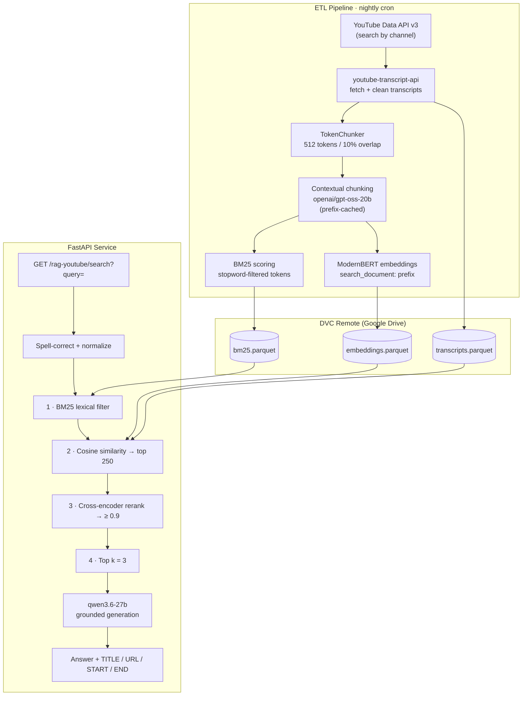

# RAG over YouTube Transcripts

A production-shaped Retrieval Augmented Generation service that answers natural-language questions using the spoken content of YouTube videos — and points you to the exact stretch of video where the answer lives.

Ask *"how does contrastive learning actually work?"* and you get a grounded answer plus a ranked set of video titles, URLs, and start/end marks telling you where to watch.

The system combines **contextual chunking**, a **precomputed BM25 index**, **dense bi-encoder retrieval**, and **cross-encoder reranking** into a single cascading funnel, served behind a FastAPI application and packaged with Docker.


---

## Table of Contents

- [Overview](#overview)
- [Architecture](#architecture)
- [The Retrieval Funnel](#the-retrieval-funnel)
- [Ingestion: The ETL Pipeline](#ingestion-the-etl-pipeline)
  - [Contextual Chunking](#contextual-chunking)
  - [Embedding Generation](#embedding-generation)
  - [BM25 Index Construction](#bm25-index-construction)
  - [Groq Client Configuration](#groq-client-configuration)
  - [Scheduling](#scheduling)
- [Generation](#generation)
- [API Reference](#api-reference)
- [Project Structure](#project-structure)
- [Getting Started](#getting-started)
- [Usage](#usage)
- [Configuration Reference](#configuration-reference)
- [Artifacts](#artifacts)
- [License](#license)

---

## Overview

Video is a terrible medium for retrieval. The knowledge is there, but it's locked inside an hour of speech with no index. This project turns a curated set of YouTube channels into a searchable, citable knowledge base.

| | |
|---|---|
| **Corpus** | Transcripts from 16 configurable YouTube channel IDs |
| **Chunking** | 512 tokens, 10% overlap, **LLM-generated context prefix per chunk** (`openai/gpt-oss-20b`) |
| **Lexical retrieval** | BM25 (k₁ = 1.5, b = 0.75), scores precomputed offline |
| **Dense retrieval** | `nomic-ai/modernbert-embed-base`, normalized, cosine via dot product |
| **Reranking** | `cross-encoder/ms-marco-MiniLM-L-12-v2` with sigmoid activation |
| **Generation** | `qwen/qwen3.6-27b` via Groq |
| **Serving** | FastAPI + Uvicorn, containerized |
| **Storage** | Parquet artifacts, DVC-versioned on Google Drive |
| **Citations** | Transcript excerpt, video title, URL, and fractional start/end marks in every grounded answer |

**Stack:** Python 3.11 · Polars · Chonkie · sentence-transformers · PyTorch · Groq · FastAPI · NLTK · DVC · uv · Docker

---

## Architecture



---

## The Retrieval Funnel

Retrieval is a four-stage cascade, deliberately ordered cheapest-to-most-expensive. Each stage narrows the candidate set so the next stage only pays for what survived.

**Stage 0 — Query preprocessing.** Punctuation is stripped, whitespace collapsed, and each token spell-corrected with `pyspellchecker` (edit distance 1). This protects the lexical stage from typos, which BM25 has no tolerance for.

**Stage 1 — BM25 lexical filter.** `bm25.parquet` holds a precomputed score for every `(video_id, chunk_index, token)` triple. Query tokens are matched against it and per-chunk scores are summed. Because scoring happened offline, this is a scan-and-aggregate — no term statistics computed at request time. If nothing matches, an empty frame is returned and the LLM falls back gracefully (see [Generation](#generation)).

Worth being precise about what this stage contributes today: **membership, not ranking.** The summed BM25 score is not used to order or truncate anything — every chunk containing at least one query token passes through, and the dense stage re-sorts them all before any cut is made. So the TF-IDF weighting and length normalization computed in `create_bm25_dataset` currently function as a set-membership test. Reciprocal Rank Fusion is what turns that discarded signal into a second ranking (see [Design Notes](#design-notes--known-limitations)).

**Stage 2 — Dense similarity.** Surviving chunks are joined to the embeddings knowledge base. The query is encoded with the `search_query: ` prefix and L2-normalized; document embeddings were normalized at ingestion, so cosine similarity reduces to a plain dot product. Embeddings are stored as `Array(Float32, 768)`, which means the candidate column comes out of `to_numpy()` as a contiguous `(n, 768)` matrix and the whole stage is one BLAS call rather than a per-row expression. Chunks with positive similarity are sorted and truncated to the **top 250**.

**Stage 3 — Cross-encoder reranking.** The 250 survivors are scored by a cross-encoder that reads the query and the chunk *jointly* — far more accurate than comparing independently-computed vectors, and far too slow to run on the full corpus. Sigmoid activation makes the output a calibrated 0–1 relevance probability, which is what makes the `relevance_threshold: 0.9` cutoff meaningful rather than arbitrary. Anything below the bar is dropped entirely.

Candidates are materialized first, then the whole list of `(query, text)` pairs goes to `CrossEncoder.predict` in a single call at an explicit `batch_size`. A per-row UDF would invoke the model once per candidate — 250 forward passes at batch size 1, paying tokenizer and tensor-allocation overhead every time — and was by a wide margin the most expensive thing in the request path.

This mirrors the dense stage exactly: materialize the candidate set, run one vectorized operation over it, attach the result as a Series. Both scoring stages read the same way, the batch size is a tuned value rather than whatever the query engine happened to choose, and the string the cross-encoder actually saw exists as a real column instead of inside a lambda — which matters the first time a ranking looks wrong and you need to inspect the input.

**The pair text is ordered deliberately.** `concat_str` builds `"{title}: {chunk}"`, and the chunk itself leads with its context prefix, so the cross-encoder reads title → context → transcript. The reranker's `max_length` is 512 tokens and a contextualized chunk exceeds that, so the tail of every chunk is truncated before scoring. Leading with the title and context means the material that *is* guaranteed to fit is the highest-signal part; reversing the order would push the summary out of the window and leave the model scoring raw speech with no framing. Do not reorder these fields.

**Stage 4 — Top-k.** The `k` highest-scoring chunks (default 3) become the context. The chunk *text* is carried through to generation alongside the metadata — the excerpt is what the answer is grounded in, and the title/URL/timestamps are what make it checkable.

Each surviving chunk carries `start` and `end` — the chunk's position expressed as a fraction of the video, derived from `chunk_index / chunk_count`. These become the "watch from here" marks in the final answer.

---

## Ingestion: The ETL Pipeline

`src/rag_youtube_transcripts/pipelines/etl.py` — run nightly by cron, or on demand with `make etl`.

Channel IDs are processed **in parallel** via `joblib` (`n_jobs=-1`). For each channel, the YouTube Data API's `search` endpoint returns up to `ingest.max_transcripts` videos ordered by publish date. Videos already present in `transcripts.parquet` are skipped, as are videos with no available transcript — so repeat runs are incremental and the corpus grows over time rather than being rebuilt.

Fetched transcripts are lowercased, whitespace-normalized, and HTML entities (`&#39;`, `&quot;`, `&amp;`) are decoded. If no new videos are found, the entire embedding stage is skipped.

### Contextual Chunking

This is the most interesting part of the ingestion pipeline.

Standard chunking destroys context. A chunk that says *"this makes it much faster than the previous approach"* is nearly useless for retrieval — the embedding has no idea what "this" or "the previous approach" refer to.

The fix, following Anthropic's contextual retrieval work: before embedding, ask an LLM to write a 2–4 sentence situating description of each chunk **given the full transcript**, then prepend it. The same chunk becomes *"This section discusses FlashAttention's memory-efficient tiling... this makes it much faster than the previous approach."* — now independently meaningful and independently retrievable.

Implementation details:

- `chonkie`'s `TokenChunker` splits on the embedding model's own tokenizer, so chunk boundaries respect the model's actual token budget rather than an approximation.
- Chunk size 512 with 10% overlap (51 tokens), so information straddling a boundary appears in both chunks.
- Transcripts longer than `index.encoding.max_transcript_tokens` (102,400) are truncated before contextualization to stay inside the 131K context window.
- Context is generated by `openai/gpt-oss-20b` at `temperature: 0.0` with `reasoning_effort: low`, all three read from `params.yaml`.
- Prompts are loaded once at module import rather than per call, so a full ETL run doesn't re-parse `params.yaml` tens of thousands of times.

#### Why the prompt is ordered the way it is

`index.chunking.user_prompt` places `{transcript}` **before** `{chunk}`. This is load-bearing, not stylistic.

```
Here is the document:
<document>
{transcript}          ← identical across every chunk of a given video
</document>

Here is the chunk of text:
<chunk>
{chunk}               ← the only part that varies
</chunk>
```

Groq applies automatic prefix caching to the gpt-oss family, discounting cached input tokens by 50%. Because the transcript leads the prompt and `encode_transcripts` processes a video's chunks consecutively, every call after the first for a given video hits a cached prefix covering nearly the entire payload. Cache entries live two hours; exact prefix matching is required.

For a one-hour video (~12K tokens, ~26 chunks) that takes the effective input cost from ~325K tokens to ~169K — enough that contextual chunking on `gpt-oss-20b` costs *less* than it did on the older, nominally cheaper `llama-3.1-8b-instant`, which had no caching support.

**If you reorder this prompt so the chunk comes first, you silently lose the discount and roughly double ingestion cost.** There is no error and no warning; only the bill changes.

#### `reasoning_effort` and why it is model-coupled

Reasoning models emit internal deliberation tokens before their visible answer. Those tokens are billed as output and count against `max_completion_tokens`, but are returned in a separate `reasoning` field rather than in `content`. Accepted values differ by family:

| Family | Accepted values |
|---|---|
| `openai/gpt-oss-*` | `low`, `medium`, `high` |
| `qwen/qwen3.6-27b` | `none`, `default` |

Writing a 2–4 sentence situating description is comprehension, not multi-step reasoning, so contextual chunking runs at `low`. Left at the model default, reasoning tokens can consume the entire `index.chunking.max_output_tokens` budget (1024) and the context comes back truncated or empty.

That failure mode is guarded rather than trusted. `add_context_to_chunk` inspects `finish_reason` and `message.content` — which the Groq SDK types as `Optional[str]` — and on a truncated or empty response logs a warning with a chunk preview and returns the **bare chunk**:

```python
if choice.finish_reason == "length" or not choice.message.content:
    logger.warning(...)
    return chunk
```

Degrading one chunk to standard (non-contextual) chunking is recoverable and visible. Prepending an empty string is not: the chunk would still be embedded and stored, looking valid forever while silently weakening retrieval. If the warning fires a handful of times across a run that's normal attrition; if it fires constantly, the model or its parameters are misconfigured and the run should be killed rather than allowed to finish.

Because the valid values are model-specific, `reasoning_effort` is asserted at the call site — a bad config value fails immediately instead of surfacing as a Groq `400` several hundred chunks into an ETL run.

### Embedding Generation

Chunks are embedded with `nomic-ai/modernbert-embed-base` and L2-normalized. Nomic's models are **asymmetric** — they require task prefixes, and getting this wrong silently degrades retrieval quality:

- Documents are embedded as `search_document: {chunk}`
- Queries are embedded as `search_query: {query}`

Encoding is batched — the full list of prefixed chunks goes to `encode` in one call rather than one call per chunk — and the resulting `(n_chunks, 768)` matrix is written straight into an `Array(Float32, 768)` column, appended to `embeddings.parquet` and keyed on `(video_id, chunk_index)`.

The fixed-width array dtype is doing three jobs. It matches what the model actually emits, so nothing is widened to `Float64` to invent precision that was never there. It makes the width a schema contract — a wrong-dimension vector is unwritable, rather than something you'd discover at query time. And it means `to_numpy()` hands back a contiguous matrix, which is what turns the dense stage into a single BLAS call instead of a per-row decode.

### BM25 Index Construction

`create_bm25_dataset` rebuilds the full lexical index with Polars' lazy engine, streaming the result straight to disk via `sink_parquet`.

1. Chunks are lowercased, stripped to `[a-z0-9\s]`, split on whitespace, and filtered against NLTK's English stopword list (punctuation removed from the stopwords themselves so they match the cleaned tokens).
2. Global statistics — mean tokens per chunk and total chunk count — are collected in a single pass.
3. Term frequency is aggregated per `(video_id, chunk_index, token)`.
4. Document frequency and IDF are computed per token with standard BM25 smoothing:

$$\text{IDF}(t) = \ln\left(\frac{N - n_t + 0.5}{n_t + 0.5} + 1\right)$$

5. The final score applies length normalization against the corpus average:

$$\text{score}(t, c) = \text{IDF}(t) \cdot \frac{f_{t,c} \cdot (k_1 + 1)}{f_{t,c} + k_1 \cdot \left(1 - b + b \cdot \frac{|c|}{\text{avgdl}}\right)}$$

The whole table is rebuilt on every run rather than updated incrementally — correct, since IDF is a global quantity that shifts whenever the corpus grows.

### Groq Client Configuration

A single client, constructed in `models.py`, is shared by both the ingestion and request paths — `index.py` uses it for contextual chunking, `rag.py` for answer generation:

```python
GROQ_CLIENT: Groq = Groq(api_key=os.getenv("GROQ_API_KEY", ""), max_retries=..., timeout=...)
```

Both settings matter, for different reasons.

**Retries** exist because contextual chunking turns ingestion into thousands of sequential API calls. Across a full run, a transient `429` or `5xx` is close to certain rather than merely possible, and the SDK's backoff absorbs it without surfacing.

**Timeouts** exist because the same client serves `/search`. Without one, a hung upstream request occupies a worker indefinitely with no error and no recovery.

### Scheduling

`bin/etl_pipeline.sh` wraps the pipeline for unattended execution and runs nightly via cron:

```cron
0 0 * * * /bin/bash /path/to/rag-youtube-transcripts/bin/etl_pipeline.sh
```

The wrapper exists because **cron is not an interactive shell**. It starts with a near-empty environment and a minimal `PATH`, so anything that works in a terminal by virtue of ambient state fails silently at midnight. The script compensates deliberately:

- **Paths are resolved from the script's own location** (`BASH_SOURCE`), not from the working directory, so the job is correct regardless of where cron invokes it.
- **Interpreters are addressed absolutely** — `.venv/bin/python` and `.venv/bin/dvc` rather than whatever `PATH` happens to resolve. `GIT` and `MAKE` come from `.env` for the same reason.
- **`.env` is sourced with `set -a`**, exporting `GROQ_API_KEY` and `YOUTUBE_DATA_API_KEY` into the child process. Cron inherits none of a login shell's environment.
- **Existence of `.env` is checked before anything else**, so a missing config fails loudly and immediately rather than midway through an API call.

**Three gates decide whether anything is published**, and all three must pass:

1. **`dvc pull` must succeed.** If the artifacts can't be retrieved, the script aborts before the pipeline runs. Otherwise the ETL would index against stale or missing inputs, treat already-processed videos as new because the old `transcripts.parquet` doesn't list them, and commit that as the new truth. Failing fast is far cheaper than untangling it afterwards.
2. **The pipeline must exit cleanly.** `main()` is decorated with `@logger.catch(reraise=True)`, so any failure propagates and the process exits non-zero. Because the three artifacts are written sequentially, exit 0 is equivalent to "all three were updated" — the shell doesn't need to check them individually.
3. **Something must have changed.** `dvc status --quiet` gates the commit chain, so unchanged nights produce no churn.

The second gate is the one that matters most. Without it a run that died partway would still reach the commit chain and publish a half-updated corpus — chunks embedded but absent from the BM25 index, or videos marked as fetched with nothing indexed behind them.

Output routing is declared once, near the top:

```bash
if [ -t 1 ]; then
    exec > >(tee -a "$LOG_FILE") 2>&1   # interactive: mirror to the terminal and the log
else
    exec >> "$LOG_FILE" 2>&1            # cron: the log is the only record
fi
```

`exec` applies the redirection to the shell itself, so every command below inherits it — including `dvc`, `git`, and `make`, whose output would otherwise go to cron's mail and effectively vanish. There's no way to add a command later that silently bypasses the log. Since nobody is watching at midnight, `logs/cron_<timestamp>.log` is the only record a run happened at all.

`logs/` holds two families of file, written by different mechanisms but pruned by one:

| File | Written by | Contains |
|---|---|---|
| `file_<timestamp>.log` | Loguru's file sink | Application events at DEBUG |
| `cron_<timestamp>.log` | Shell redirection in the wrapper | Everything: the above plus `dvc`, `git`, and `make` output |

```bash
find "${LOGS_DIR}" \( -name 'cron_*.log' -o -name 'file_*.log' \) -type f -mtime +6 -delete
```

**Retention deliberately lives in the wrapper, not in the sink.** Loguru's own `retention=` argument runs at process exit and globs the log directory — and because `Parallel(n_jobs=-1)` spawns loky workers that re-import `logger.py`, every worker configured a file sink and ran its own retention pass. Those passes raced: one process would `os.stat` a file another had already deleted, producing `FileNotFoundError` in an `atexit` callback on every run. Harmless, but noise on a log you want to be able to trust at a glance.

Moving the prune into the wrapper leaves exactly one process doing it, before the pipeline starts rather than after — so cleanup still happens on a night the run fails.

A side effect worth knowing: those same workers each still create a `file_*.log`, so a run produces one per worker plus one for the parent. The content is duplicated into `cron_*.log` anyway, since spawned children inherit the redirected stderr, so nothing is lost — there are simply more files than runs. Guarding the sink with `multiprocessing.parent_process() is None` would collapse it to one per run.

---

## Generation

The final answer is produced by `qwen/qwen3.6-27b` on Groq. Each retrieved result is passed to the model as a block containing `TITLE`, `URL`, `START`, `END`, and `EXCERPT`, with multiple results joined by a configurable delimiter so sources stay distinguishable.

The `EXCERPT` is the **contextualized** chunk — the machine-written situating summary followed by the verbatim transcript text — the same string that was embedded at ingestion. Passing the summary along with the raw text gives the model framing the transcript alone doesn't carry; the tradeoff is that the summary is synthetic, so the system prompt explicitly warns against attributing it to the speaker. Watch for phrasing like *"the speaker explains that this section covers…"* — that's the tell that the prefix is being read as spoken content, and the fix is to strip it (`pl.col("chunk").str.split("\n").list.last()`, safe because raw transcripts are whitespace-normalized and contain no newlines).

Both halves of the exchange are configured: `rag.system_prompt` sets the rules, `rag.user_prompt` is the `{context}` / `{query}` envelope that `create_user_prompt` fills with the assembled entries. Neither lives in code, so the prompt can be tuned without touching `rag.py`.

The system prompt encodes two behaviors:

**Grounded mode.** When retrieval returns usable context, the `EXCERPT` text is the primary source. The model is instructed to synthesize rather than quote at length, to attribute each claim to the specific video it came from rather than merging claims under one citation, to surface disagreement between excerpts instead of silently picking one, and to state plainly what the excerpts do *not* cover rather than filling gaps from prior knowledge. Citing `TITLE`, `URL`, `START`, and `END` for every video drawn on is mandatory, not encouraged.

Because the transcripts are automatically generated — lowercase, unpunctuated, and carrying speech-recognition errors — the prompt also tells the model to read them charitably rather than treating those artifacts as meaningful.

**Graceful degradation.** When context is empty, irrelevant, or insufficient, the model is instructed to answer from parametric knowledge *with sources*, explicitly told not to fabricate, told to **state that the answer is not based on the retrieved videos**, and told to append a YouTube search URL for the original query. This matters more than it looks: an aggressive `relevance_threshold: 0.9` means empty retrieval is a normal outcome, not an error state, and the system stays useful instead of returning "I don't know." Labeling the mode matters now that grounded answers exist — without it, a reader can't tell a transcript-backed answer from a parametric one.

Generation runs at `temperature: 0.3` rather than a conversational default. Citations must reproduce `URL`, `START`, and `END` verbatim, and YouTube video IDs are effectively random character sequences — there is no linguistic prior making the correct next character more probable, so every character sampled at high temperature is a chance to emit a link that 404s. A confidently wrong URL is worse than no citation at all. Lower temperature also reduces drift into the prompt's "insufficient context" escape hatch when the retrieved context was in fact adequate.

Generation runs with `reasoning_effort: none`, valid for Qwen but **not** for the gpt-oss family — swapping this model requires changing that value to `low` or `medium`. See [Design Notes](#design-notes--known-limitations) on the preview-tier risk attached to this model choice.

**Failure handling differs deliberately from the chunking path.** There, a truncated response is discarded because nothing downstream can detect a corrupted context. Here the output is terminal — a person reads it — so the two cases are split:

| Condition | Chunking | Generation |
|---|---|---|
| `content` is `None` or empty | return bare chunk | return a fallback message |
| `finish_reason == "length"` | return bare chunk | **return the content**, log a warning |

A clipped answer is still useful and the reader can see it stopped mid-sentence, so it is served rather than thrown away. The truncation warning is a tuning signal: if it fires regularly, `rag.max_output_tokens` is too low for answers citing three videos with formatting. Guarding the empty case also prevents a `None` from reaching the endpoint's `response_model=dict[str, str]`, which would surface as an opaque `500` rather than a usable error.

---

## API Reference

Base path: `/rag-youtube`

### `GET /rag-youtube/healthz`

Liveness probe.

```json
{ "status": "ok" }
```

### `GET /rag-youtube/search`

| Parameter | Type | Description |
|---|---|---|
| `query` | `string` | Natural-language question |

```bash
curl -G http://localhost:8080/rag-youtube/search \
     --data-urlencode "query=how does contrastive learning work"
```

```json
{
  "response": "Contrastive learning trains a model to pull ...\n\nTITLE: ...\nURL: https://youtu.be/...\nSTART: 0.34\nEND: 0.41"
}
```

Interactive docs are served at `/docs` (`http://localhost:8080/docs` in Docker, `http://localhost:8000/docs` under `make api`).

---

## Project Structure

```
.
├── src/rag_youtube_transcripts/
│   ├── config.py              # Config.Paths + OmegaConf params loader
│   ├── logger.py              # Loguru: stderr at INFO, timestamped file at DEBUG
│   ├── models.py              # shared expensive objects: encoders, Groq client, knowledge base
│   ├── ingest.py              # fetch transcripts + metadata (no model dependencies)
│   ├── index.py               # contextual chunking, embeddings, BM25 scoring
│   ├── retrieval.py           # query prep + the BM25 → cosine → rerank cascade
│   ├── rag.py                 # prompt assembly + Groq generation
│   ├── app/
│   │   ├── main.py            # FastAPI app factory
│   │   ├── router.py          # /rag-youtube prefix
│   │   └── endpoint.py        # /healthz, /search
│   └── pipelines/
│       └── etl.py             # parallel fetch → chunk → embed → index
├── bin/
│   └── etl_pipeline.sh        # cron wrapper: env, absolute paths, DVC/Git sync
├── artifacts.dvc              # DVC pointer to artifacts/ (3 parquet files)
├── params.yaml                # one config block per consuming module, prompts included
├── Dockerfile                 # multi-stage uv build, inference-only
├── docker-compose.yaml        # backend service, 8080:8000
├── Makefile
└── pyproject.toml
```

Note the `.dockerignore`: it whitelists the package but **excludes `pipelines/`**, so the shipped image contains only what's needed to serve. `docker-compose` bind-mounts `artifacts/` and the NLTK data rather than baking the corpus into the layer.

**The module split follows dependencies, not categories.** `models.py` is the single home for everything expensive to construct — the bi-encoder, the cross-encoder, the Groq client, the spell checker, and the lazy knowledge base — so each is built once per process and imported wherever it's needed. `index.py` and `retrieval.py` import from it; `ingest.py` deliberately does not.

That last point is the payoff: `fetch_transcripts` has no model dependencies at all, so it can be imported and tested in milliseconds rather than after two Torch models finish loading. It's also the function most worth testing — HTML entity decoding, the already-fetched skip path, the non-200 branch.

---

## Getting Started

### Prerequisites

- Python 3.11
- [uv](https://docs.astral.sh/uv/)
- Docker (optional, for containerized serving)
- A [Groq API key](https://console.groq.com/) and a [YouTube Data API v3 key](https://console.cloud.google.com/)
- Access to the DVC Google Drive remote (or your own)

### Installation

```bash
git clone https://github.com/ncheymbamalu/rag-youtube-transcripts.git
cd rag-youtube-transcripts

make install     # uv sync
make nltk        # download the NLTK stopword corpus into .venv/nltk_data
```

### Environment

Create a `.env` in the project root:

```dotenv
GROQ_API_KEY=gsk_...
YOUTUBE_DATA_API_KEY=AIza...

# absolute binary paths — required by bin/etl_pipeline.sh, since cron's PATH is minimal
GIT=/usr/bin/git
MAKE=/usr/bin/make
```

The API keys are read by the application; `GIT` and `MAKE` exist only for the cron wrapper. Resolve them with `which git` and `which make` on the host that runs the schedule — a value that works on your laptop will not necessarily be right on a server.

### Artifacts

```bash
dvc pull         # fetch transcripts.parquet, embeddings.parquet, bm25.parquet
```

To use your own remote, point `.dvc/config` at your Drive folder:

```bash
dvc remote modify myremote url gdrive://<YOUR_FOLDER_ID>
```

---

## Usage

### Run the API locally

```bash
make api         # uvicorn with --reload → http://localhost:8000/docs
```

### Run in Docker

```bash
make start_container   # docker compose up -d → http://localhost:8080/docs
make stop_container
```

### Refresh the corpus

This happens automatically every night. To trigger it by hand:

```bash
make etl               # dvc pull → fetch → chunk → embed → index
make update_artifacts  # dvc add → git commit → dvc push → git push
```

To install or verify the schedule:

```bash
crontab -e             # 0 0 * * * /bin/bash /abs/path/to/bin/etl_pipeline.sh
crontab -l             # confirm the entry has five time fields before the command
ls -t logs/cron_*.log | head -1   # most recent unattended run
```

The wrapper does what `make etl` and `make update_artifacts` do together, plus the environment setup cron requires. Running it directly (`bash bin/etl_pipeline.sh`) is the fastest way to check that the scheduled path works before trusting it overnight.

### Development

```bash
make check       # ruff check src
make fix         # ruff check --fix src
make clean       # remove __pycache__, .ruff_cache, .pytest_cache
```

### Programmatic use

```python
# retrieval only — no Groq call, no API key needed
from rag_youtube_transcripts.retrieval import get_semantic_search_results

print(get_semantic_search_results("what is a mixture of experts"))

# retrieval + generation
from rag_youtube_transcripts.rag import generate_response

print(generate_response("what is a mixture of experts"))
```

The first import is deliberately usable on its own. `retrieval` knows nothing about `rag`, so recall@k measurements and threshold tuning run against the corpus without spending a token or introducing LLM nondeterminism into a retrieval number.

---

## Configuration Reference

Everything lives in `params.yaml`, organized into one top-level block per consuming module. Each module loads exactly its own block via `Config.load_params(Path(__file__).stem)`, so `models.py` reads `models:`, `retrieval.py` reads `retrieval:`, and so on. Ownership of every setting is obvious from its path, and no module can quietly reach into another's configuration.

### `models` — shared objects

| Key | Default | Description |
|---|---|---|
| `embedding` | `nomic-ai/modernbert-embed-base` | Bi-encoder; asymmetric, requires task prefixes |
| `reranker` | `cross-encoder/ms-marco-MiniLM-L-12-v2` | Cross-encoder, 512-token input cap |

### `ingest` — corpus fetching

| Key | Default | Description |
|---|---|---|
| `max_transcripts` | `50` | Max videos fetched per channel per run |
| `youtube_data_api` | Search endpoint URL | YouTube Data API v3 search |

### `index` — chunking and encoding

| Key | Default | Description |
|---|---|---|
| `chunking.llm` | `openai/gpt-oss-20b` | Production tier, ~1000 T/s, prefix caching |
| `chunking.temperature` | `0.0` | Deterministic context |
| `chunking.max_output_tokens` | `1024` | Budget shared with reasoning tokens |
| `chunking.reasoning_effort` | `low` | gpt-oss accepts `low`/`medium`/`high` only |
| `chunking.system_prompt` | — | Role framing for the context writer |
| `chunking.user_prompt` | — | `{transcript}` / `{chunk}` template — **transcript first, for prefix caching** |
| `encoding.chunk_size` | `512` | Tokens per chunk (overlap is `chunk_size // 10`) |
| `encoding.max_transcript_tokens` | `102_400` | Transcript truncation limit before contextualization |

### `retrieval` — search cascade

| Key | Default | Description |
|---|---|---|
| `k` | `3` | Chunks passed to the generator |
| `relevance_threshold` | `0.9` | Minimum cross-encoder relevance probability |

### `rag` — answer generation

| Key | Default | Description |
|---|---|---|
| `llm` | `qwen/qwen3.6-27b` | **Preview tier** — see limitations |
| `temperature` | `0.3` | Low, for verbatim citation fidelity |
| `max_output_tokens` | `4096` | Truncation past this is logged, not discarded |
| `reasoning_effort` | `none` | Qwen accepts `none`/`default` only |
| `system_prompt` | — | `{delimiter}` / `{youtube_search_url}` / `{query}` template |
| `user_prompt` | — | `{context}` / `{query}` template wrapping the assembled entries |
| `delimiter` | `====================` | Separator between context blocks |
| `youtube_search_url` | Search URL | Fallback link when retrieval is empty |

### `etl` — corpus scope

| Key | Default | Description |
|---|---|---|
| `youtube_channel_ids` | 16 IDs | Channels to ingest |

Prompts live here alongside the parameters that shape them, so prompt changes are config changes rather than code changes. Two consequences worth knowing:

- **Placeholders are positional contracts.** All four prompts are consumed with `str.format()`, so any literal `{` or `}` added to a prompt raises at call time. The contracts are `{transcript}`/`{chunk}`, `{delimiter}`/`{youtube_search_url}`/`{query}`, and `{context}`/`{query}` — smoke-test a `.format()` after editing.
- **`reasoning_effort` is model-coupled.** Its valid values depend on `llm` in the same block, which is why the two sit together — changing one without the other is the migration's sharpest edge.

---

## Artifacts

Three Parquet files, DVC-tracked under `artifacts/`. The corpus grows with every ingest, so treat the size as a few hundred MB rather than a fixed number — `artifacts.dvc` records the exact bytes and hash for whatever commit you're on:

| File | Contents |
|---|---|
| `artifacts/data/transcripts.parquet` | `video_id`, `creation_date`, `title`, `transcript` |
| `artifacts/data/embeddings.parquet` | `video_id`, `chunk_index`, `chunk` (contextualized), `embedding` (`Array(Float32, 768)`) |
| `artifacts/data/bm25.parquet` | `video_id`, `chunk_index`, `token`, `score` |

`artifacts.dvc` pins the exact content hash, so any historical corpus state is recoverable by checking out that commit and running `dvc pull`.

---

## License

MIT © 2026 [ncheymbamalu](https://github.com/ncheymbamalu). See [LICENSE](LICENSE).